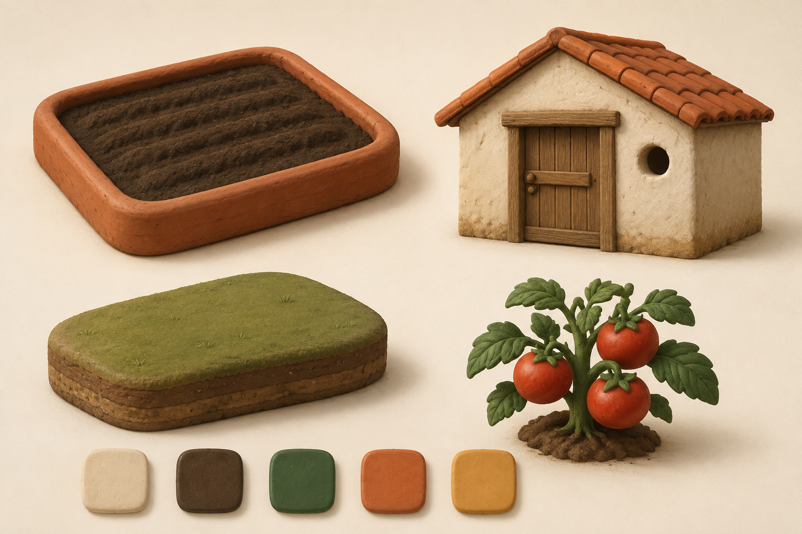
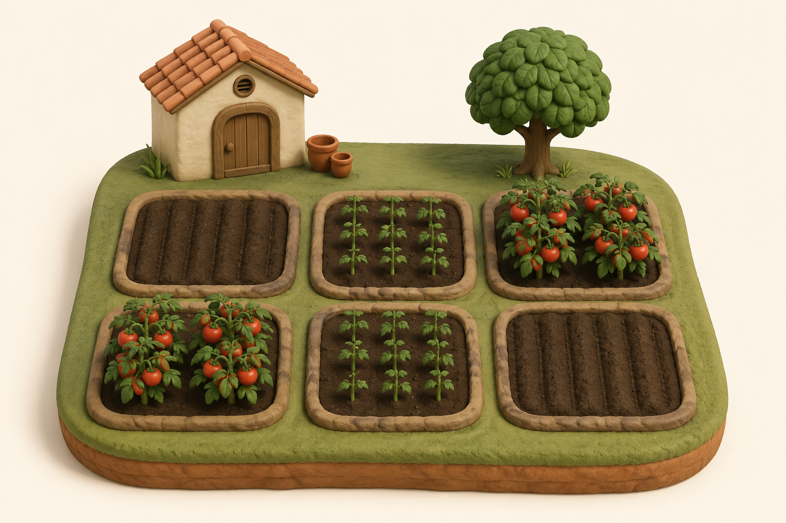
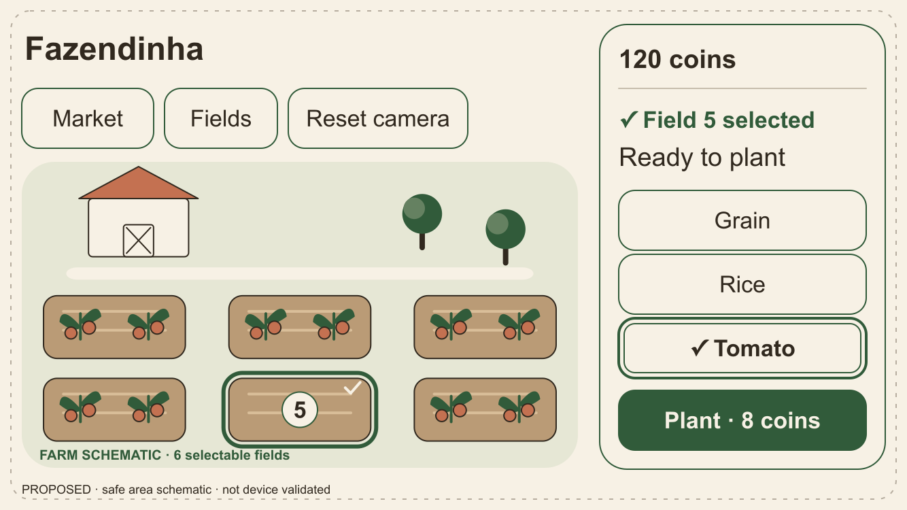
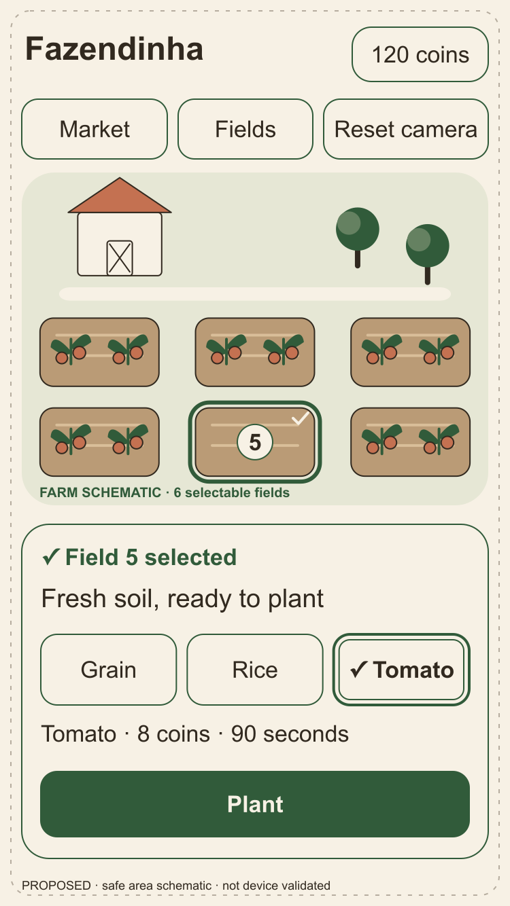
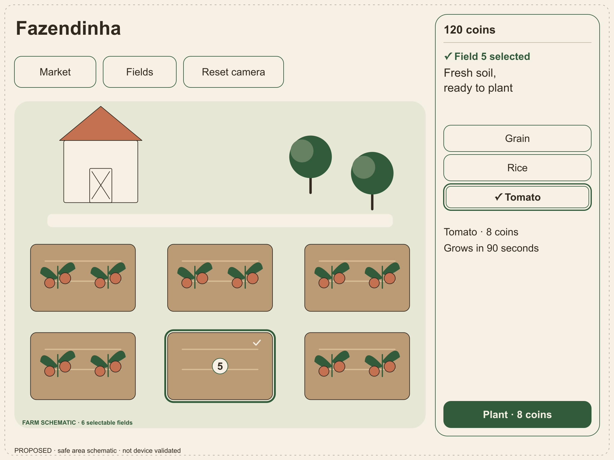
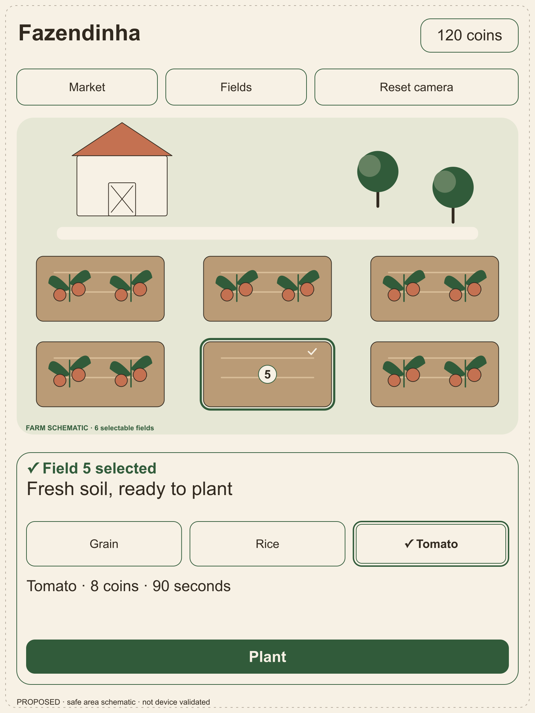
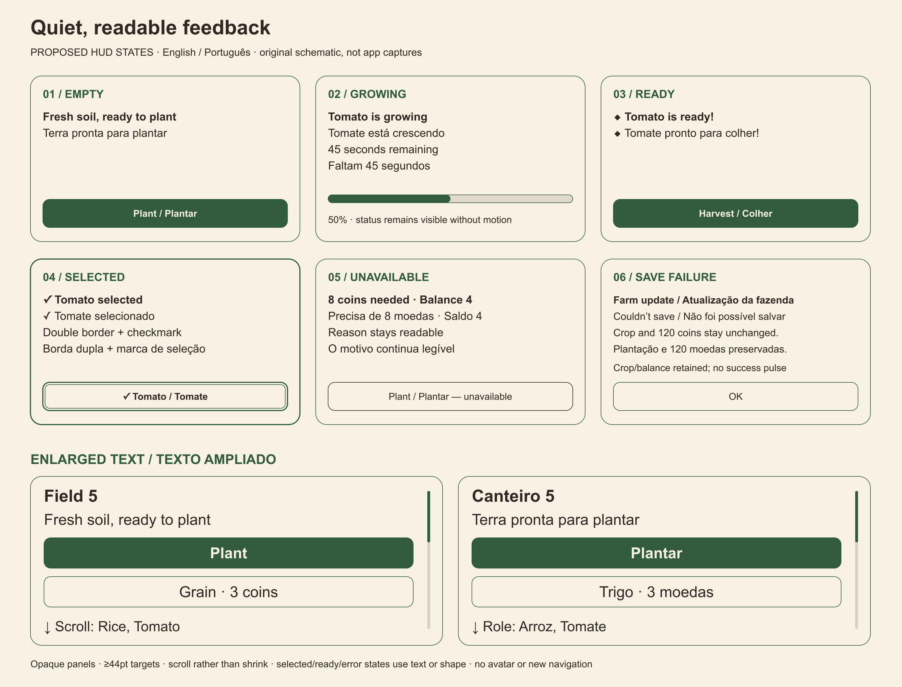

# Fazendinha: warm crafted countryside

Design baseline for [#43](https://github.com/csambrosio01/fazendinha/issues/43), the first design task in [roadmap #52](https://github.com/csambrosio01/fazendinha/issues/52). Audience: contributors making subsequent art, camera and UI decisions. The player experience is an approachable farm for short, unhurried visits: **I tend a small place, see what needs care, and leave it growing.**

This document and its original boards are the complete design slice. They propose a direction; they do not change the running app or claim physical-device validation. #52 is the sequencing authority; the older general roadmap in this folder is not a prerequisite list.

## Four product pillars

| Pillar | Design consequence | Review question |
| --- | --- | --- |
| Read the farm first | Crop silhouettes and field boundaries carry the scene; the HUD supports one selected field. | Can a new player locate the selected field and its next action without opening a menu? |
| Patient care | Show accurate growth and readiness without urgent, flashing presentation. Preserve the existing offline crop-to-market loop. | Is leaving and returning presented as normal play? |
| Handmade character | Rounded clay-like forms, restrained surface variation and a small cared-for garden. | Does the object still read when texture and decorative details disappear? |
| Equal agency | Fields controls offer the same selection and actions as the 3D farm. | Can the action and result be understood through labels without color, motion or precise visual tapping? |

The player is an **implied caretaker**. A storehouse, plain pots and orderly gaps between beds suggest care without a visible character. No avatar or direct locomotion is required. This is a fictional countryside setting, not a reconstruction of a particular culture or another game's world.

## Visual language

| Specimen / position | Adopt | Objective constraint |
| --- | --- | --- |
| Plot / upper left | Thick rounded rectangular rim and broad soil furrows | Keep the perimeter continuous and distinguish empty soil from the surrounding terrain at home camera scale. |
| Building / upper right | Squat cream body, shallow tiled gable, broad timber door, round vent | Roof and body are the two dominant masses; no signage, face or ornate facade. Keep it behind the playable beds. |
| Terrain / lower left | Soft grassy top, rounded edge and a visible earth layer | Terrain has lower visual contrast than crop/action cues; seams and small grass marks must not resemble selectable fields. |
| Tomato / lower right | Grounded stem, broad leaf groups and conspicuous fruit clusters | Recognize the crop from silhouette plus fruit form; no essential detail depends on tiny veins or texture. |

Use broad bevels and mild asymmetry, not glossy plastic, thin filigree or noisy photoreal surfaces. Crop clusters remain inside the bed silhouette at home framing. For comparative scale, keep a mature crop no taller than one bed's short side and the storehouse body around one to two bed widths; verify visibility before adding detail. These are art review ratios, not asset-import specifications.

Soft diffuse daylight comes from the upper left, with warm highlights and gentle contact shadows. Critical crops never sit in unreadable black shadow. Materials are predominantly matte; the existing procedural roughness of 0.85 is a useful starting point, not a required production shader. No day/night or weather system is implied.

### Palette and text roles

| Role | Color | Use |
| --- | --- | --- |
| Cream | `#F7F1E5` | Opaque HUD surface; light building body |
| Soil | `#31291F` | Primary text, outlines and dark earth |
| Leaf | `#315B3A` | Primary action background; secondary text |
| Terracotta | `#C47151` | Roofs, rims and decorative accents; not normal text backgrounds |
| Straw | `#D8AC55` | Decorative harvest/currency accent, paired with soil text |

Calculated opaque sRGB contrast: soil on cream **12.72:1**, leaf on cream / cream on leaf **6.94:1**, soil on straw **6.78:1**. Soil on terracotta is only **3.97:1**, so do not use that pair for normal text. Tomato red identifies produce, never readiness by itself. The artwork's shading is illustrative; these hex values govern flat UI studies.

### Composition and animation character

1. **Foreground and center:** six clearly separated plot centers; the current three-by-two arrangement is retained for comparison with the prototype, not a new layout system.
2. **Rear left:** storehouse and two plain pots suggest the absent caretaker. Use the specimen board's building silhouette; door/vent placement in this composition is exploratory.
3. **Rear right:** one broadleaf tree balances the building without obscuring a field. More decorative props are not required.
4. **Around the island:** quiet space protects silhouette readability. At default framing, HUD panels must not cover any plot center.

Motion should feel settled: proposed ambient sway up to 3 degrees, ready-marker travel up to 4 screen points, and one success pulse lasting at most 300 ms. No camera shake, flashing readiness, endless reward bounce or background animation catch-up. Reduce Motion removes sway, drifting/rotating decoration, bounce and bursts; static size, labels and ready markers still convey current growth. Suspend scene updates when inactive or a sheet covers the farm. These are guidance for later polish, not new animation code in #43.

## Camera, HUD and interaction

**Landscape-first on both iPhone and iPad; portrait remains a supported design adaptation.** Use the elevated oblique home view, bounded drag-to-orbit and pinch-to-zoom, plus a labeled Reset camera control. Camera gestures do not plant or harvest. Tap selects a field; an explicit contextual button performs its action. Selection, camera and effects remain transient presentation state.

The HUD contains coins and labeled Market, Fields and Reset camera controls. In compact landscape, coins sit at the top of the trailing panel. The selected-field panel contains status, applicable seed choices and a single primary action. Avoid permanent navigation bars or speculative inventory/upgrades/quest controls. Market and Fields retain the existing sheet model. Icons supplement text: consistent simple outlines, a diamond for readiness, a check and double boundary for selection, and an explanatory disabled state; no emoji-only controls. Scene icon and collision details are later implementation work.

### Orientation studies

The following SVGs are editable schematics with one SVG unit per logical point, not screenshots. PNGs are review previews. The frames are conservative layout studies, not a claim that a particular device has been tested. System safe areas are reserved schematically; production must use actual safe-area insets. `project.yml` currently does not explicitly declare supported orientations; this issue does not change it.

| Study | Logical size | Adaptation | Editable source |
| --- | --- | --- | --- |
| Phone landscape | 667 × 375 pt | Compact trailing field panel; farm remains visible beside it | [SVG](ArtDirection/hud-phone-landscape.svg) |
| Phone portrait | 375 × 667 pt | Field panel moves below the farm; controls wrap | [SVG](ArtDirection/hud-phone-portrait.svg) |
| Tablet landscape | 1024 × 768 pt | Trailing panel, greater farm breathing room; do not enlarge HUD density | [SVG](ArtDirection/hud-tablet-landscape.svg) |
| Tablet portrait | 768 × 1024 pt | Bottom panel; retain the same control order and actions | [SVG](ArtDirection/hud-tablet-portrait.svg) |

### State, accessibility and localization

[Editable state board](ArtDirection/hud-states.svg).

| State | Feedback and action |
| --- | --- |
| Empty | Label “Empty field”; offer existing seeds, cost and Plant action. |
| Growing | Identify crop and remaining time; no early harvest affordance. |
| Ready | Static diamond marker plus a readiness label; Harvest is the primary action. |
| Selected | Visible outline plus field number/title; selection is distinct from readiness. |
| Insufficient coins | Disabled Plant plus “Not enough coins”; do not rely on dimming alone. |
| Save failure | Dismissible, readable failure message; retained crop, balance and selection; no success pulse or implied completed action. |

Design targets:

- Controls have at least **44 × 44 pt** hit regions with separation. Use **17 pt** body/action text at the default size, system font metrics and Dynamic Type; do not shrink text to fit.
- At larger text sizes, wrap labels, stack seed choices and allow the field panel to scroll while keeping every action reachable. Preserve the farm as context, but accessible text/action reachability takes priority over seeing all six plots simultaneously.
- Aim for at least **4.5:1** normal-text contrast and **3:1** essential non-text boundaries. Inspect the actual composite surface, not just the palette. These are review targets, not a claim of accessibility conformance. See [W3C text contrast guidance](https://www.w3.org/WAI/WCAG22/Understanding/contrast-minimum.html) and [non-text contrast](https://www.w3.org/WAI/WCAG22/Understanding/non-text-contrast.html).
- VoiceOver flow: farm summary and utilities → selected field/status → seed choices → contextual action. Fields supplies equivalent selection, readiness and actions without interpreting the 3D scene. Announce a committed result once; do not announce countdown changes every second.
- Keep player-facing strings separate from artwork. Show English and Brazilian Portuguese in reviews: “Fields / Canteiros”, “Market / Mercado”, “Plant / Plantar”, “Harvest / Colher”, “Ready to harvest / Pronto para colher”. The board copy is proposed wording, not an installed translation catalog. Future implementation uses localized complete strings and locale-formatted quantities/times.

## Annotated references and originality

| Reference | Observation to carry forward | Limit |
| --- | --- | --- |
| [V&A: Studio Pottery, an introduction](https://www.vam.ac.uk/articles/studio-pottery-an-introduction) | Handmade ceramics show variation within simple, readable forms. Use rounded massing and restrained material irregularity. | Do not reproduce an individual vessel, decoration or artist's signature. |
| [RHS: How to grow tomatoes](https://www.rhs.org.uk/vegetables/tomatoes/grow-your-own) | Leaf groups, stems and fruit trusses provide recognizable structural cues for the tomato specimen. | Simplify botanical form; do not introduce pruning, watering or disease mechanics. |

These linked references provide material and natural-form observations. All embedded boards are original work for this issue; no reference photographs are embedded. [Provenance and exact image prompts](ArtDirection/PROVENANCE.md) identify the generated studies and locally authored diagrams.

FarmVille and Hay Day are category context only. Do not copy their UI, icons, characters, signature buildings, layouts, terminology, assets or progression. This direction uses its own restrained material palette and implied-caretaker garden. Avoid both recognizable competitor compositions and unlicensed third-party source assets.

## Acceptance evidence and follow-up review

| #43 acceptance check | Evidence in this change |
| --- | --- |
| Concise direction, annotated references, original mood boards | Four pillars, visual language, reference table, material board and farm board |
| Representative plot, crop, building, terrain and HUD | Four labeled specimen positions and the orientation/state studies |
| Documented portrait/landscape choices for supported devices | Landscape-first policy and four point-sized phone/tablet layouts |
| Contrast, motion, legibility and touch targets considered | Palette calculations, motion bounds, noncolor states, 44 pt controls, bilingual and enlarged-type studies |
| Objective guidance for later asset and UI issues | Specimen constraints and the review checklist below |

Review later contributions against these checks:

- At default scale, all six plot centers are outside HUD occlusion; field boundaries, crop identity, selection and readiness remain distinguishable in grayscale and without texture.
- The four specimen types share broad rounded forms, matte surfaces and the stated visual hierarchy; the building and scenery never compete with actionable fields.
- Each orientation retains Market, Fields, reset, selection and the applicable action. Text and hit targets retain their minimum sizes; enlarged/localized content remains reachable.
- UI text and important outlines meet the contrast targets; readiness and failure remain understandable without color or animation.
- The same core action is available through Fields, with readable committed success/failure feedback and a static Reduce Motion equivalent.

The boards receive visual/geometry review at their declared sizes. To regenerate the editable HUD diagrams, run `python3 Docs/ArtDirection/hud-author.py` from the repository root; the script uses only the standard library and checks target geometry. The SVGs can also be edited directly. Regenerate the paired PNG previews with an available local SVG renderer at 2× scale; they are intentional review artifacts, not app resources. See [provenance](ArtDirection/PROVENANCE.md) for rendering details.

App regression commands remain `make test` and `make ci-local`; exact results belong in the PR. No game rules change, so new unit tests or an API/save migration would be unrelated work. Static mockup review does **not** establish working VoiceOver, Dynamic Type, orientation behavior, physical-device performance or playtest success. Validate those in #23/#26/#27/#50 as their implementation lands.

Boundary: #44 owns authored asset import and production conventions; #45 owns performance budgets; #23 owns navigation implementation; #16 owns additional crops. No runtime art replacement, camera tuning, localization catalog, save changes, gameplay additions, progression, animals, placement, sound or online systems are implemented here. Preserve local-first behavior and the Domain/Application boundary from SwiftUI and RealityKit.

Cost constraint: use existing local tools and the included Codex allowance, with no purchased assets, extra credits, separately billed APIs or paid runtime dependencies. Public distribution and its Apple membership decision belong to a later release issue.
